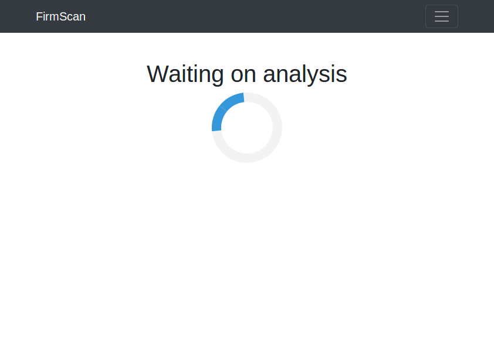

# FirmScan
Scan firmware images for security vulnerabilities.

Made at Copenhacks 2018.

# Inspiration
A lot of firmware for IoT devices is filled with security holes. We want to make it easy and scalable to check firmware images for vulnerabilities.

# What it does
Analyses firmware images for vulnerabilities and creates a report describing them.

# How we built it
We have a frontend with a webserver where users are able to upload firmware images. The images are distributed to workers with RabbitMQ. When the workers have processed the firmware they report back through RabbitMQ to the webserver and the webserver displays the report.

The workers start by unpacking the firmware image with binwalk and then proceeds to run different modules that check for different types of vulnerabilities.

# What's next for FirmScan
Adding more modules to check for vulnerabilities.

# Images

